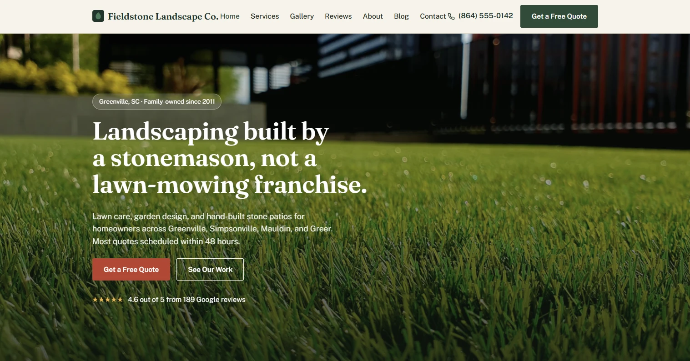
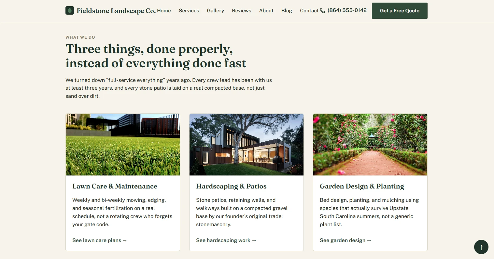
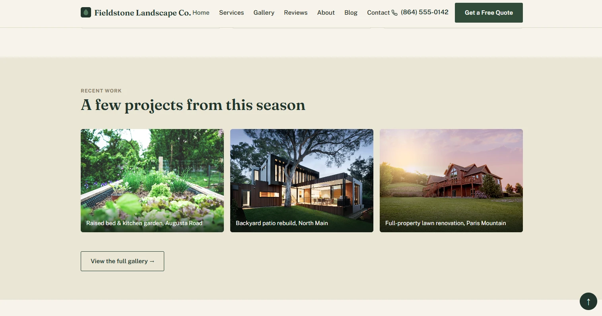
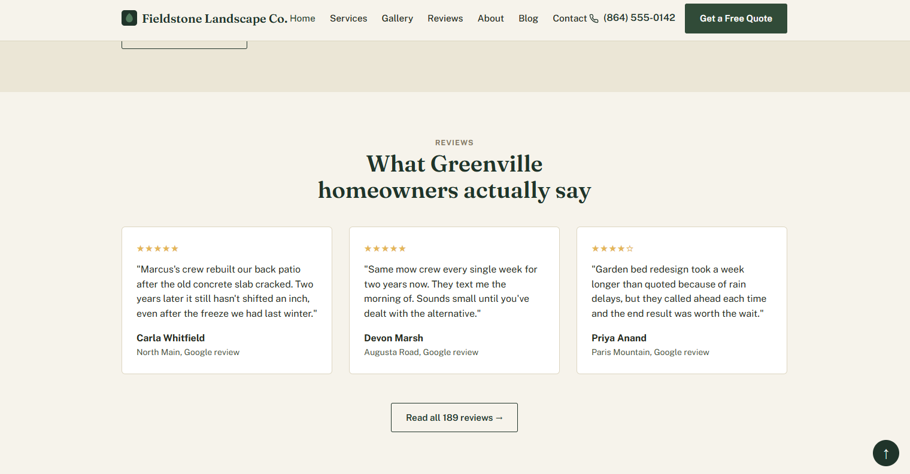
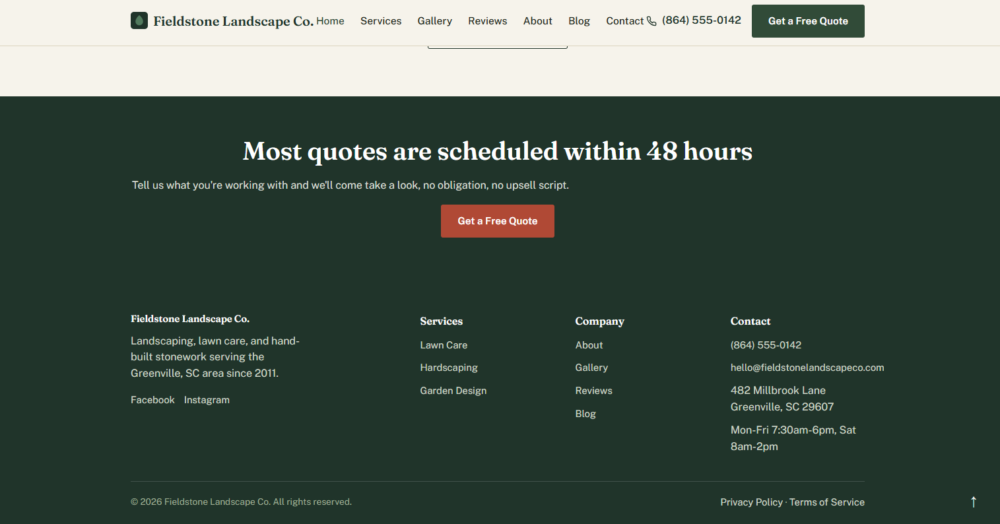

# Fieldstone Landscape Co.
(For reference this website was built with a simple prompt, "Build a fictional landscaping website using all front-end skills no back-end use all fictional information." This whole website was also built with just that one singular prompt clean and simple. If you wanted something better you should always expect to give more in-depth information and prompts for better results.)
A local-service landscaping business site, built as a working demo of this repo's skills: `anti-ai-slop-design`, `pre-launch-technical-audit`, the full SEO set, `layout-spacing-and-alignment`, `typography-craft`, `component-detail-polish`, `motion-system`, and `industry-visual-execution`'s landscaping pattern, among others.

<!-- A few notes on what this is and why it's the first example, in your own words, go here. -->

## Screenshots

### Home: hero

### Home: services

### Home: recent work

### Home: reviews

### Home: CTA and footer

## Fictional business details

Everything here (name, phone number, address, reviews) is invented for the demo, not a real business:

- **Name:** Fieldstone Landscape Co.
- **Location:** Greenville, SC (fictional)
- **Phone:** (864) 555-0142 (555-01xx is the FCC's reserved fictional number range)
- **Rating:** 4.6 out of 5 from 189 reviews (fictional)
